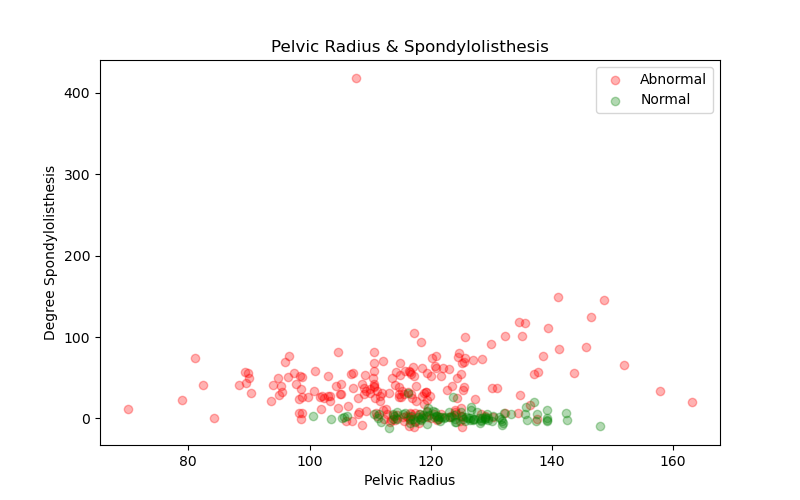
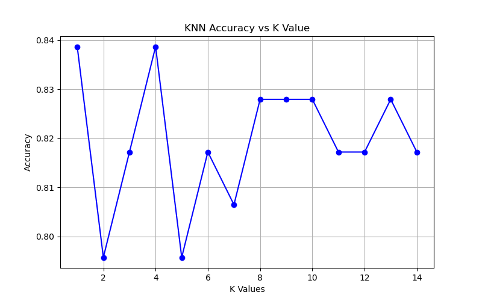
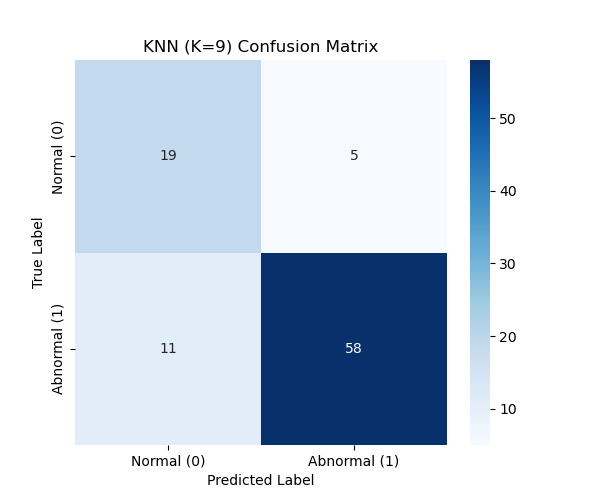

# 🦴 Biomechanical Features Classification using K-Nearest Neighbors (KNN)

A machine learning project that classifies orthopedic patients into **Normal** or **Abnormal** categories using the **K-Nearest Neighbors (KNN)** algorithm. The project demonstrates data preprocessing, hyperparameter tuning, model evaluation, and visualization techniques for binary classification.


---

# 📌 Project Overview

This project applies the **K-Nearest Neighbors (KNN)** algorithm to classify orthopedic patients based on their biomechanical features.

### Project Information

- **Dataset:** Biomechanical Features of Orthopedic Patients (`column_2C_weka.csv`)
- **Task:** Binary Classification
  - **Normal = 0**
  - **Abnormal = 1**
- **Algorithm:** K-Nearest Neighbors (KNN)
- **Hyperparameter Optimization:** Evaluation of different K values
- **Optimal K:** **9**
- **Best Test Accuracy:** **82.8%**

---

# 📊 Dataset & Visualizations

## 📍 Feature Distribution

The scatter plot below illustrates the relationship between **Pelvic Radius** and **Degree Spondylolisthesis**.



---

## 📍 Hyperparameter Tuning

Different **K** values (1–14) were evaluated to determine the optimal model.

The selected value (**K = 9**) provides:

- Highest test accuracy
- Stable performance
- Reduced overfitting
- Odd K value to avoid tie-breaking issues



---

# 📈 Model Evaluation

The dataset was split into:

- **70% Training Set**
- **30% Testing Set**

using **K = 9**.

## Confusion Matrix



---

## Classification Report

```text
              precision    recall    f1-score    support

Normal (0)       0.63       0.79       0.70         24
Abnormal (1)     0.92       0.84       0.88         69

Accuracy                              0.83         93
Macro Avg         0.78       0.82       0.79
Weighted Avg      0.85       0.83       0.83
```

---

## 🎯 Best Model Performance

| Metric | Value |
|---------|------:|
| Accuracy | **82.8%** |
| Precision (Abnormal) | **92%** |
| Recall (Abnormal) | **84%** |
| F1-Score (Abnormal) | **88%** |

### Key Finding

The KNN classifier demonstrates strong performance in detecting **abnormal orthopedic conditions**, achieving **92% precision** and **84% recall**, making it reliable for identifying abnormal cases while minimizing false positives.

---

# 🛠 Technologies Used

- Python 3
- NumPy
- Pandas
- Matplotlib
- Seaborn
- Scikit-learn

---

# ⚙️ How to Run

### 1. Clone the repository

```bash
git clone https://github.com/aoktayzkn/biomechanical-knn-classification.git
cd biomechanical-knn-classification
```

### 2. Install dependencies

```bash
pip install -r requirements.txt
```

> If `requirements.txt` is not available:

```bash
pip install pandas numpy matplotlib seaborn scikit-learn
```

### 3. Run the project

```bash
python biomechanical_dataset_knn.py
```

---

# 📂 Repository Structure

```text
biomechanical-knn-classification/
│
├── biomechanical_dataset_knn.py
├── column_2C_weka.csv
├── Confusion_Matrix.png
├── KNN_Accuracy_vs_K_Values.png
├── Pelvic_Radius_and_Spondylolisthesis.png
├── requirements.txt
└── README.md
```

| File | Description |
|------|-------------|
| `biomechanical_dataset_knn.py` | Main Python script implementing the KNN classifier |
| `column_2C_weka.csv` | Biomechanical dataset |
| `Confusion_Matrix.png` | Confusion matrix visualization |
| `KNN_Accuracy_vs_K_Values.png` | Accuracy comparison across different K values |
| `Pelvic_Radius_and_Spondylolisthesis.png` | Scatter plot of selected biomechanical features |
| `requirements.txt` | Project dependencies |
| `README.md` | Project documentation |

---

## 🚀 Future Improvements

- Perform cross-validation
- Apply feature selection techniques
- Optimize hyperparameters using GridSearchCV
- Save the trained model using Joblib
- Build a simple web interface with Streamlit

---

## 🔗 Related Projects

This repository focuses on the **K-Nearest Neighbors (KNN)** algorithm.

A Random Forest implementation using the same orthopedic patients dataset is available here:

- **Orthopedic Patients Classification using Random Forest**
  https://github.com/aoktayzkn/orthopedic-patients-classification

# 📚 References

- Scikit-learn Documentation
- NumPy Documentation
- Pandas Documentation
- UCI Machine Learning Repository

---

# 👤 Author

**Ali Oktay Özkan**

GitHub: https://github.com/aoktayzkn

---

# 📄 License

This project was developed for educational and academic purposes.
